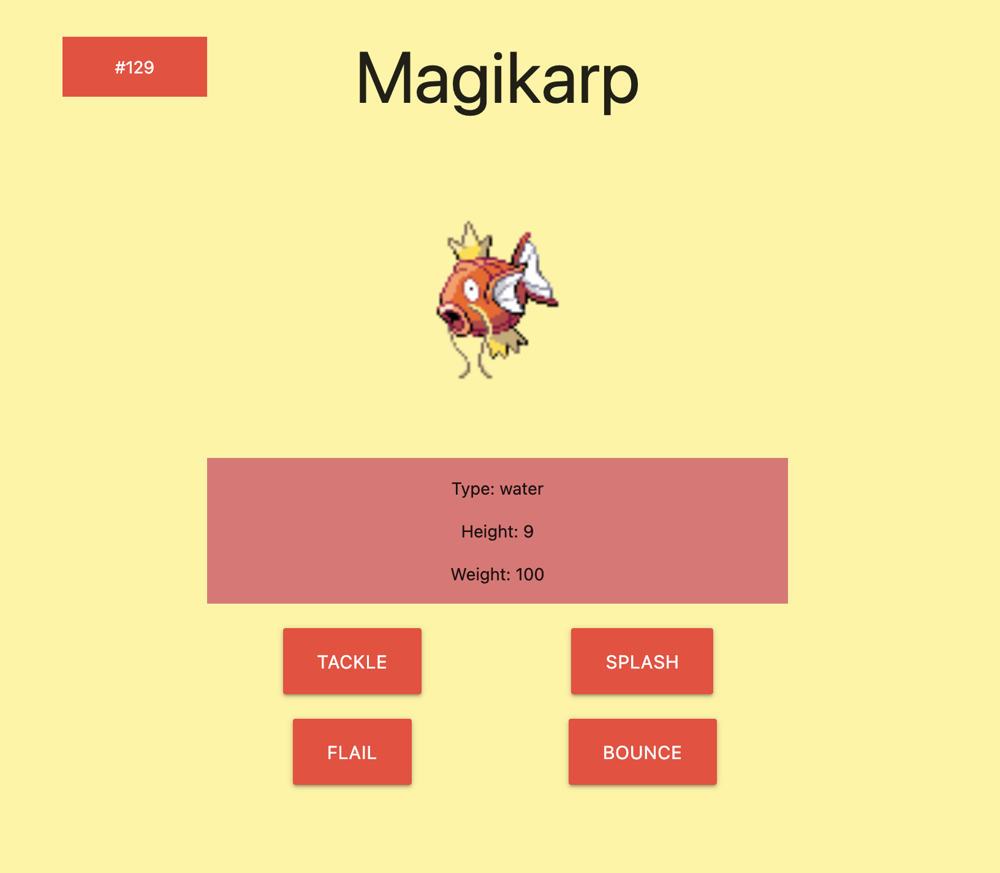

# Node Practice with Pokemon
## Description
* This site is simply me practicing using node.js and the inquirer package, combined with fetch requests to public APIs. Feel free to use for your own practice/learning.

* User can choose a pokemon to dynamically generate a webpage for that pokemon.

## Installation
```
npm install
```

## Usage
```
node index.js
```
* Then follow the prompts
* Open your new index.html to see your pokePage!

## Sample page: 
